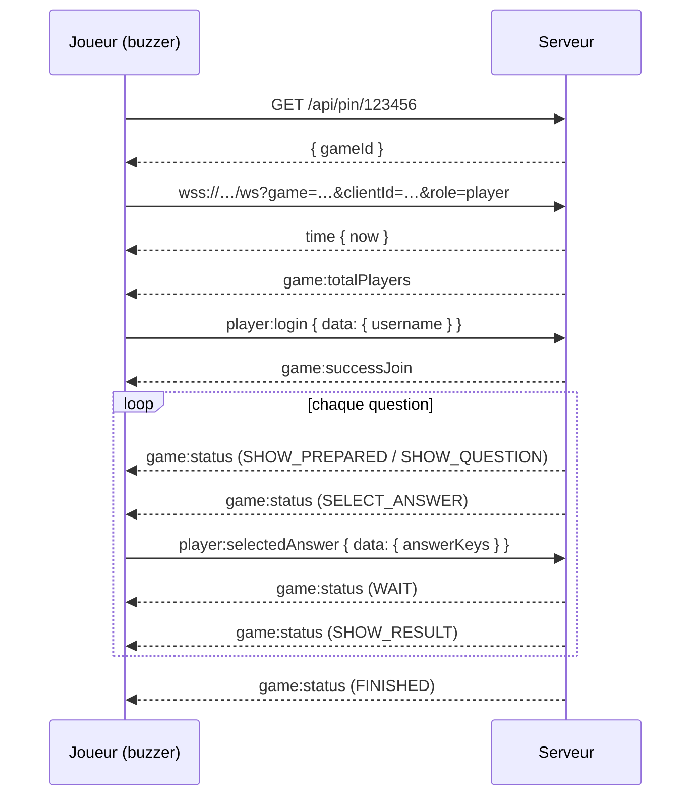
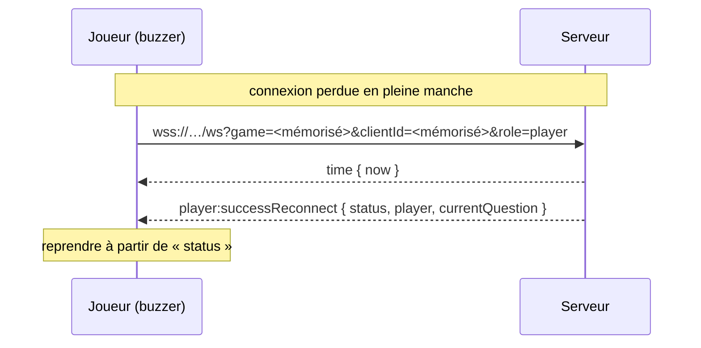

# Protocole WebSocket

Le dialogue client-serveur passe par une **WebSocket brute** sur `/ws`. Ce
document décrit la partie **joueur** du protocole, de quoi écrire un client
autre que l'interface web — un buzzer physique à base d'ESP32, par exemple.

> Protocole interne, non stabilisé : il peut changer d'une version à l'autre
> sans période de dépréciation. À confronter à la version que vous déployez.

L'amont utilisait Socket.IO, qui ne tourne pas sur Workers. Il a été remplacé
des deux côtés par cette couche minimale. **Les noms d'événements et leurs
charges utiles n'ont pas changé** — c'était l'objectif : seul le transport
diffère.

## Se connecter

La socket est liée à une partie **dès son ouverture** : il faut donc connaître
l'identifiant de partie avant de l'ouvrir. Le code d'invitation se résout en
HTTP, sans authentification :

```
GET /api/pin/<code à 6 chiffres>
  200  { "gameId": "..." }
  404  { "error": "errors:game.notFound" }
```

Puis :

```
wss://<hôte>/ws?game=<gameId>&clientId=<uuid>&role=player
```

- `clientId` est un identifiant stable et aléatoire que votre appareil génère
  une fois et conserve (en flash sur un ESP32, par exemple). C'est lui qui
  permet de retrouver sa place après une coupure. Le réutiliser déclenche la
  reconnexion plutôt que la création d'un nouveau joueur.
- `role` vaut `player` ou `manager`. Le serveur ne vous croit pas sur parole :
  il compare le `clientId` à celui enregistré comme animateur au moment de la
  création de la partie.
- Aucune authentification côté joueur. Qui connaît le code à six chiffres entre
  dans la salle : traitez ce code comme une clé.
- **Aucun keepalive applicatif.** Il n'y a ni ping ni pong à répondre — pas de
  fenêtre à tenir, contrairement à Socket.IO.

Une ouverture vers une partie inexistante répond **404** : la salle a été
effacée, rien ne sert de réessayer.

## Le format des trames

Dans les deux sens, une trame est un objet JSON à deux champs :

```json
{ "e": "<nom de l'événement>", "d": <charge utile> }
```

Les événements liés à une partie en cours acceptent une charge de la forme
`{ gameId, data: { … } }` ; `gameId` est facultatif, la socket sachant déjà à
quelle partie elle appartient.

**La toute première trame reçue est l'heure du serveur :**

```json
{ "e": "time", "d": { "now": 1756612800000 } }
```

Les échéances voyagent en dates absolues (`endsAt`). Comparez-les à l'heure du
serveur corrigée de l'écart, jamais à votre horloge locale — un appareil en
retard de dix secondes afficherait un décompte faux.

Les changements d'état arrivent tous sur `game:status` :

```ts
{ name: Status, data: StatusDataMap[Status], seq: number }
```

`seq` croît strictement. Une trame dont le `seq` est inférieur au dernier reçu
est périmée et doit être ignorée — cela arrive après une reconnexion.

## Entrer dans la partie

Une fois la socket ouverte, choisir un nom :

```
{ "e": "player:login", "d": { "data": { "username": "Alice" } } }
```

- `username` fait de 1 à 20 caractères
  ([validators/auth.ts](../packages/common/src/validators/auth.ts)).
- `game:successJoin <gameId>` : vous êtes dans la salle. Le serveur envoie aussi
  `game:totalPlayers <n>` à tout le monde.
- `game:errorMessage <clé>` : nom invalide, ou ce `clientId` a déjà un joueur
  dans la partie.

Ensuite, il suffit de réagir aux `game:status`.

## Le déroulé d'une manche

| Statut | Charge (`data`) | Ce que ça veut dire |
| --- | --- | --- |
| `SHOW_START` | `{ time, subject }` | Décompte avant le début. |
| `SHOW_PREPARED` | `{ totalAnswers, questionNumber }` | Écran « préparez-vous », avec le nombre de réponses de la question à venir. |
| `SHOW_QUESTION` | `{ question, media?, cooldown, endsAt }` | L'énoncé est affiché, les réponses **ne sont pas** encore ouvertes. |
| `SELECT_ANSWER` | `{ question, answers, media?, time, endsAt, totalPlayer, questionType, options? }` | Les réponses sont ouvertes. `answers.length` donne le nombre de boutons utiles (2 à 4). `questionType` vaut `single` ou `multi`. |
| `SHOW_RESULT` | `{ correct, message, points, myPoints, rank, aheadOfMe }` | Votre réponse était-elle bonne, ce qu'elle rapporte, votre total et votre rang. |
| `WAIT` | `{ text }` | Écran d'attente. |
| `FINISHED` | `{ subject, top, rank? }` | Fin de partie, classement. |

Autres événements utiles en cours de partie :

- `game:updateQuestion { current, total }` — on a changé de question.
- `game:totalPlayers <n>` — l'effectif a changé. **Diffusé par paquets** : les
  arrivées rapprochées sont regroupées sur 250 ms, le compteur monte donc par
  sauts.
- `game:playerAnswer <n>` — nombre de joueurs ayant répondu. Regroupé de la
  même façon.
- `game:reset <clé>` — la session n'est plus valable : animateur parti avant le
  début, exclusion, partie expirée. Retour à l'écran d'accueil.

## Répondre

Valable uniquement pendant `SELECT_ANSWER`, et **seule la première réponse
compte** ; les suivantes sont ignorées sans bruit.

```
{ "e": "player:selectedAnswer", "d": { "data": { "answerKeys": [1] } } }
```

- `answerKeys` contient des index dans le tableau `answers`, à partir de 0. Une
  seule valeur pour une question `single`, autant que de boutons pressés pour
  une `multi`.
- Les points dépendent de la rapidité, calculés côté serveur à partir de `time`
  et de l'instant de la réponse.
- Suivent un `WAIT` avec `{ text: "game:waitingForAnswers" }`, puis
  `SHOW_RESULT` quand la question se ferme — au temps écoulé, ou dès que tout
  le monde a répondu.

C'est le seul événement qu'un buzzer à quatre boutons ait besoin d'envoyer.

## Se reconnecter

**Rien à faire.** Rouvrez simplement la socket avec le même `clientId` et le
même `gameId` : le serveur reconnaît la place et envoie de lui-même

```
player:successReconnect { gameId, status, player, currentQuestion }
```

où `status` est l'état courant, de quoi reprendre l'affichage où il en était.
C'est une différence avec l'amont, qui exigeait un `player:reconnect` explicite.

Il faut donc conserver `clientId` **et** `gameId` entre deux redémarrages : le
`gameId` ne s'obtient qu'en résolvant à nouveau le code d'invitation.

Si la salle a disparu, l'ouverture répond 404 — inutile d'insister.

## Quitter

Une coupure subie n'appelle aucun événement : la place est gardée pour un
retour. Un départ **volontaire**, lui, se déclare, pour que l'animateur le voie
tout de suite :

```
{ "e": "player:leave", "d": {} }
```

Avant le début de la partie, cela retire complètement le joueur ; une fois
commencée, cela équivaut à une déconnexion.

## Exemple complet



Après une coupure, la reconnexion tient en une ouverture :



## Référence

Les types complets sont dans
[packages/common/src/types/game/socket.ts](../packages/common/src/types/game/socket.ts),
les valeurs exactes des chaînes dans
[packages/common/src/constants.ts](../packages/common/src/constants.ts).

**Client → serveur**

| Événement | Charge |
| --- | --- |
| `player:login` | `{ data: { username: string } }` |
| `player:selectedAnswer` | `{ data: { answerKeys: number[] } }` |
| `player:leave` | `{}` |

**Serveur → client**

| Événement | Charge |
| --- | --- |
| `time` | `{ now: number }` — première trame, l'heure du serveur |
| `game:status` | `{ name, data, seq }` |
| `player:successReconnect` | `{ gameId, status, player, currentQuestion }` |
| `game:successJoin` | `gameId: string` |
| `game:totalPlayers` | `n: number` |
| `game:updateQuestion` | `{ current, total }` |
| `game:playerAnswer` | `n: number` |
| `game:errorMessage` | `clé: string` |
| `game:reset` | `clé: string` |

Les `clé` sont des identifiants de traduction utilisés par l'interface web
(`errors:game.notFound` par exemple), pas du texte lisible : traitez-les comme
des codes d'erreur symboliques.

`player:checkPin` et `player:join` **n'existent plus sur le fil** : l'interface
web les émet en interne, et son adaptateur les traduit en appel HTTP à
`/api/pin/<code>`. Un client tiers appelle directement cette route.

Le côté animateur — créer une partie, mener la manche, exclure un joueur,
gérer les quiz — sort du cadre d'un buzzer. Voir
[packages/worker/src/game-room.ts](../packages/worker/src/game-room.ts).

Retour au [sommaire](README.md).
